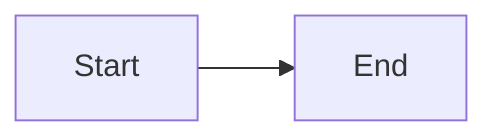

# FixIt Content Skill

FixIt extends Hugo's content system with 30+ shortcodes, 7 render hooks, and custom markdown syntax for diagrams, charts, music players, encryption, and more.

Use code fence extended syntax (`` ```mermaid ``, `` ```echarts ``, `` ```timeline ``, `` ```file-tree ``) where available -- it is preferred over the shortcode form.

Override any embedded shortcode by placing a file with the same name in `layouts/_shortcodes/`.

## Quick Reference

### Shortcodes

| Shortcode | Purpose | Key Params |
| :-------- | :------ | :--------- |
| `admonition` | Callout box (13 types) | `type`, `title`, `open` |
| `tabs` / `tab` | Tabbed content | `type` (underline/pill/card/segment), `placement` |
| `mermaid` | Diagrams | `wrapper`, `filename` |
| `echarts` | Data visualization | `width`, `height`, `js`, `file`, `data` |
| `timeline` | Chronological events | `reverse`, `animation`, `placement` |
| `file-tree` | Directory structure | `path`, `level`, `file`, `data` |
| `typeit` | Typing animation | `tag`, `code`, `group`, `loop`, `speed` |
| `mapbox` | Interactive maps | `lng`, `lat`, `zoom`, `light-style`, `dark-style` |
| `music` | Music player (APlayer) | `url`, `auto`, `server`, `id` |
| `image` | Image with lightgallery | `src`, `alt`, `caption`, `linked`, `loading` |
| `link` | Enhanced links | `href`, `content`, `card`, `download` |
| `details` | Collapsible section | `summary`, `open` |
| `fixit-encryptor` | Partial encryption | `password`, `message` |
| `gist` | GitHub Gist embed | username, gist-id, filename |
| `script` | Inline JavaScript | (content body) |
| `style` | Inline CSS/SCSS | style string, tag |
| `reward` | Donation buttons | `wechatpay`, `alipay`, `paypal` |
| `bluesky` | Bluesky post embed | post URL |
| `bilibili` / `douyin` | Video embeds | video ID |
| `spotify` | Spotify embed | spotify URL |

### Extended Markdown

| Feature | Syntax | Output |
| :------ | :----- | :----- |
| Alert | `> [!TIP] Title` | Styled callout banner |
| Ruby | `[text]^(annotation)` | Ruby annotation |
| Fraction | `[num]/[den]` | Stacked fraction |
| Font Awesome | `:(fa-class):` | Icon inline |
| Math inline | `$formula$` | KaTeX/MathJax |
| Mark | `==text==[type]` | Colored highlight |
| Insert | `++text++` | Inserted text |
| Subscript | `H~2~O` | H2O |
| Superscript | `2^10^` | 2^10 |
| Task list | `- [x] Done` | Checkbox with status |
| Color preview | `` `#0969DA` `` | Inline color swatch |

## Common Examples

### Admonition (blockquote alert preferred)

```markdown
> [!TIP] Pro Tip
> Use blockquote alert syntax for cross-platform compatibility.

> [!WARNING]+ Foldable
> Click to expand or collapse this content.
```

### Tabs with Code Blocks

```markdown

{}<div>Hello</div>{}
{}console.log('hi'){}

```

### Code Fence Extended (preferred over shortcodes)

````markdown

````

````markdown
```echarts
{ "xAxis": { "type": "category", "data": ["A","B","C"] }, "yAxis": { "type": "value" }, "series": [{ "type": "bar", "data": [10, 20, 30] }] }
```
````

### Tabbed Code Blocks

````markdown
```python {group="languages", name="Python"}
print('Hello')
```
```js {group="languages", name="JS", .active}
console.log('Hello');
```
````

## Reference Files

| Topic | Description | Reference |
| :---- | :---------- | :-------- |
| Shortcodes | All 30+ extended shortcodes with syntax and examples | [references/shortcodes.md](references/shortcodes.md) |
| Render Hooks | Code blocks, headings, images, links, tables, blockquotes, passthrough | [references/render-hooks.md](references/render-hooks.md) |
| Content Features | Front matter fields, extended markdown, content organization | [references/content-features.md](references/content-features.md) |
