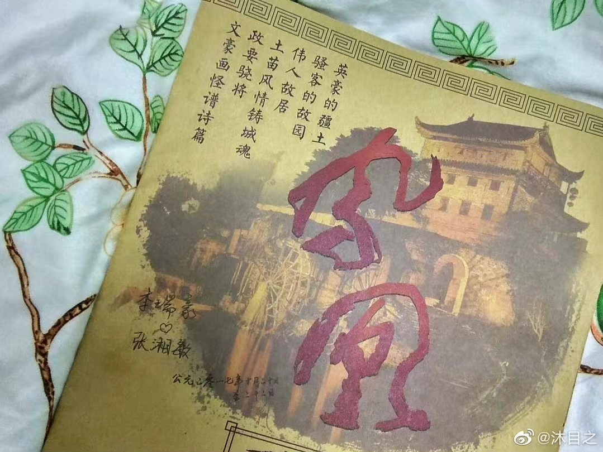
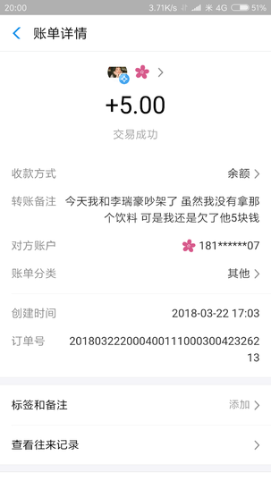



番茄和西红柿 土豆和马铃薯 我喜欢的人和你

---

（づ●'◡'●) づ ❥&nbsp;❤


2016 年 11 月 11 日 00:01  
进入大学的第一个光棍节也是最后一个，在这天收到了 zxm 的表白，很幸运遇到她一开始有很多顾虑，甚至有点惊慌失措，我还没有做好爱一个人的准备，当然也挺感动的。   
2016 年 11 月 17 日  
晚九点，亲民楼下，很激动我们在一起了。   
2018 年 6 月 3 日 12:54:47  
过年的时候在朋友圈看到一句话：   
“循着光 随着阳  
有人在冷暖人世间逃窜  
也有人在清朗秋空中仰目长盼   
只愿你我  
不管时光如何逝去  
真挚不渝 不忘初心”   
2018 年 7 月 11 日   
虽然张湘敏生气起来是很犟，但是过后，大多数时候还是很可爱的   
2018 年 8 月 15 日 AM 记录美好  
在 e313 的实验室把这个页面好好整理了一下，以后我们经历过的每个特殊的日子都会记录在下面。“爱您”😘。   
2018 年 8 月 17 日 七夕  
在一起后一起过的第一个七夕节，七夕快乐！   
2018 年 9 月 24 日 中秋  
今天中秋节，直到下午 5 点多你才从西安一路舟车劳顿赶到学校，天公不作美，湘潭下着小雨。我来校门接的你。你说你饿坏了，然后我们一起在学校半边街 17CC 那吃的晚餐，虽然没有去商场大鱼大肉的吃了，但是有你就好，中秋快乐！   
2018 年 10 月 14 日 周日  
今天在这个页面的字体族中加入了我的手写字体，写了 1 年半的字体，也是为你而写的字体。沐目体。字体笔画比较细如果看不清可以全选文字这样可能会好点！   
2018 年 10 月 18 日 15:55  
今天是我和你在一起的第 700 天，准确的说还有 8 个小时 5 分钟。就在前两天我俩还在吵架，原因是我打球迟到了。可是我知道我错了，就是因为迟到。可是尴尬的是我打字打成了‘吃饭’，So, 你多生气了好几天，既然是个误会，那还是不要生气了喔。官宣就不官宣了，就这样吧，爱你！    
2018 年 11 月 17 日  
不知不觉在一起我们已经在一起两周年了，你还记得两年前的今天星期几嘛，还记得自己笑的多开心吗？我都记得！永远爱你！   
2018 年 12 月 31 日  
2018 最后一天了，有个傻子还在担心喝不到 18 年最后一杯奶茶而担心呢，还好有我啊，半圆的益禾堂关门了，还好我在北苑的益禾堂给你买了你最喜欢的禾风奶绿。然后在麦乐季买了店里最后三个蛋挞。今天的雪还是没有融化，一路走得很快，怕冷掉，见到你的那一刻，真的很暖和！就酱紫。   
2019 年 1 月 1 日  
猪，新年快乐鸭，在一起的第三个年头开始了！   
2019 年 1 月 17 日 ❤  
猪仔仔，谁说我不记得你的生日啊，我日历提前三天就提醒我了！生日快乐呀！木马   
2019 年 2 月 4 日 除夕  
明天就是猪年了，那你真的成了猪仔仔了！在一起三年每年过年都会给你压岁钱，现在没工作也没钱，都是我平时省的，现在只能给你 99 块！你还每次推我 52.0，相信以后，99 会变成 999 甚至更多。   
2019 年 2 月 14 日 情人节  
今天是 2 月 14，传说中的情人节。相隔半个湖南。没能在一起过，只希望我心，你知！   
2019 年 2 月 17-19 日  
这几天在吵架，隔三两个月总会有次小吵闹。其实我真的不想和你吵架。有的时候却被你气的不知道说什么，你也是吧，没少被我气！我希望以后都能和你一起享受开心快乐的时光！   
2019 年 3 月 22 日  
~~player.lruihao.cn ： 20161117 20161117~~  
老婆我没有不理你也没有不见了喔！我在做左边那个播放器，以后想听的歌我都给你添加过来，有没有很喜欢，有没有一点少女心爆棚的感觉！！！么么哒   
2019 年 7 月 7 日  
今天是我大三在学校的最后一天，明天我也回家了。要去实习了，大学三年也没有什么舍不得的，唯独放不下的就是你，今日一别，再见就是国庆了。我想你，爱你。   
2019 年 7 月 25 日  
今天打开便签看到一张截图，是你送给我的，我希望你也是，要一直开心，你笑起来真好看，很可爱！上面的文字是：   
“愿你出走半生，归来仍是少年。  
可少年，是很难在成人的世界里如鱼得水的。  
愿你出走半生，归来已然成年。  
用的了手段，玩的转规则，看的透世事，过的顺风顺水，  
却保留一点小小的真性情，坚强骄傲，宽容慈悲，仅此而已，已是大幸。  
没有人可以一直天真如少年，除非付出巨大的代价。”   
等我实习发了工资我可以给 zxm 买裙子，买软软的可以抱着睡觉的娃娃，还可以给崽崽买眉笔，鞋子等等，等以后呢存够了钱可以和 zxm 去旅游，北京、上海、海南、秦皇岛等等 ...  
哦对了，上次一起去韩大地吃烧烤知道了张湘敏不喜欢吃芒果！   
2019 年 9 月 22 日 周日  
今天我花了一个星期天重写了一下这个页面，更方便以后记录美好；  
顺便表达一下来深圳一个多月对你的思念。马上就到国庆了，我的票也买好了，马上又可以见到你了，要和你一起学习一起约会！   
2019 年 9 月 30 日-10 月 6 日 国庆  
30 号清晨，我非常激动地踏上了深圳发往湘潭的火车，去火车站的路上，期间坐公交车坐反了，竟然阴差阳错到了清湖地铁站。反正，总之我就是顺利的到了湘潭，带着一颗激动地心，因为马上就要见到你了。
想起一句话，“所爱隔山海，山海皆可平”，我想大概如此。又想起一句诗，“玲珑骰子安红豆，入骨相思知不知”，我知你知。
第一眼见到你，感觉很熟悉很亲切，在明德到亲民一起走过三年的路上，还记得，大一的时候你问我，愿意陪你走完这三年的路吗。岂只三年，我还想和你再走很多年。
国庆期间，和你一起吃了心心念念的螺蛳粉，吃了大碗先生的湘菜，一起去了肯德基吃了肯德基的饭，买了饮料拍了合照，约会散步，抓拍到了你盛世侧颜。陪你逛了街，你送了我长大后第一件衬衫，很好看我很喜欢。
又想起了上次和你在凤凰的逛街，过去的一切都让我满意和回味无穷，我相信未来定是如此，岁月静好，爱你如初。（土味情话说来就来！）
6 号晚上我一个人踏上了返程的火车，没叫任何人送我包括你，离别总是不舍的，这次特别特别的强烈。气氛不要太伤感，我们大家都在成长的路上，我们一直都在对方的心里。考研加油！
晚安。   
2019 年 11 月 17 日 三周年  
承蒙时光不弃，1095 天，你一直在，我一直爱，三周年快乐。   
2020 年 5 月 28 日 22:20:34  
你说 “那以后有机会我就继续做你的小朋友好了”  
你离开了，我爱的人不爱我了。   
2020 年 6 月 28 日 19:33:17  
你说 “有什么不开心的可以和我倾诉嘿嘿”   
2022 年 1 月 14 日  
“生日快乐哦，祝好”  
“谢谢”   
2022 年 2 月 2 日 02:02  
终有弱水替沧海，养好性格，好好生活，先足够优秀，再大胆拥有，该释怀了。  
💔


 

  
<b>Memories</b>

  
  
  
  
  
  


setTimeout(() => {
  document.querySelector('html').style.filter = 'grayscale(100%)';
  document.querySelector('.shaky').className = '';
}, 287000);
