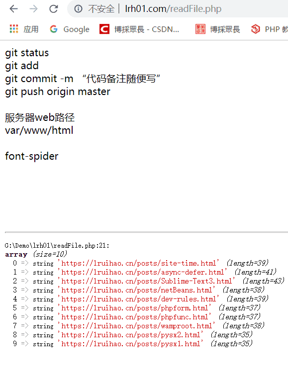

## 普通方法

首先采用`fopen()`函数打开文件，得到返回值的就是资源类型。接着采用 while 循环一行行地读取文件，然后输出每行的文字。`feof()`判断是否到最后一行，`fgets()`读取一行文本。

<!--more-->

```php
<?php

  //首先采用“fopen”函数打开文件，得到返回值的就是资源类型。
  $file_handle = fopen("C:\\Users\\李瑞豪、\Desktop\\备忘录。txt","r");
  if ($file_handle){
      //接着采用 while 循环一行行地读取文件，然后输出每行的文字
      while (!feof($file_handle)) { //判断是否到最后一行
          $line = fgets($file_handle); //读取一行文本
          echo $line; //输出一行文本
          echo "<br />"; //换行
      }
  }
  fclose($file_handle);//关闭文件

?>
```

`readfile（）`函数，返回一整个 String

```php
echo readfile("C:\\Users\\李瑞豪、\Desktop\\备忘录。txt");
```

## 快速方法

`file()`函数把整个文件读入一个数组中。  
数组中的每个元素都是文件中相应的一行，包括换行符在内。  
**语法**

```php
file(path,include_path,context)
```

|     参数     | 描述                                                                                                                                                                                                                    |
| :----------: | :---------------------------------------------------------------------------------------------------------------------------------------------------------------------------------------------------------------------- |
|     path     | 必需。规定要读取的文件。                                                                                                                                                                                                |
| include_path | 可选参数`include_path` 可以是以下一个或多个常量：<br/>**`FILE_USE_INCLUDE_PATH`**在 include_path 中查找文件。<br/>**`FILE_IGNORE_NEW_LINES`**在数组每个元素的末尾不要添加换行符<br/>**`FILE_SKIP_EMPTY_LINES`**跳过空行 |
|   context    | 可选。规定文件句柄的环境。context 是一套可以修改流的行为的选项。若使用 NULL，则忽略。                                                                                                                                   |

```php
<?php

  $filepath="H:\\lruihao.cn\\public\\baidu_urls.txt";
  echo "<hr/>";
  //将文件每一行读到一个数组里面去
  $texts = file($filepath, FILE_IGNORE_NEW_LINES | FILE_SKIP_EMPTY_LINES);
  var_dump($texts);

?>
```

## 结果


