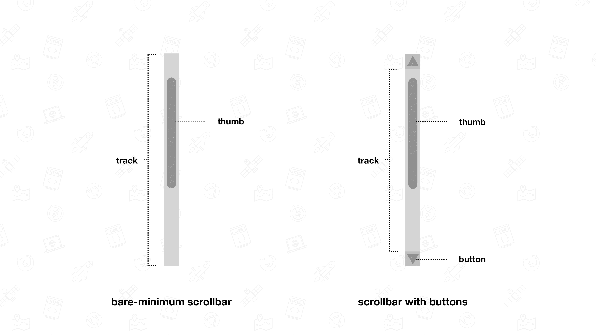
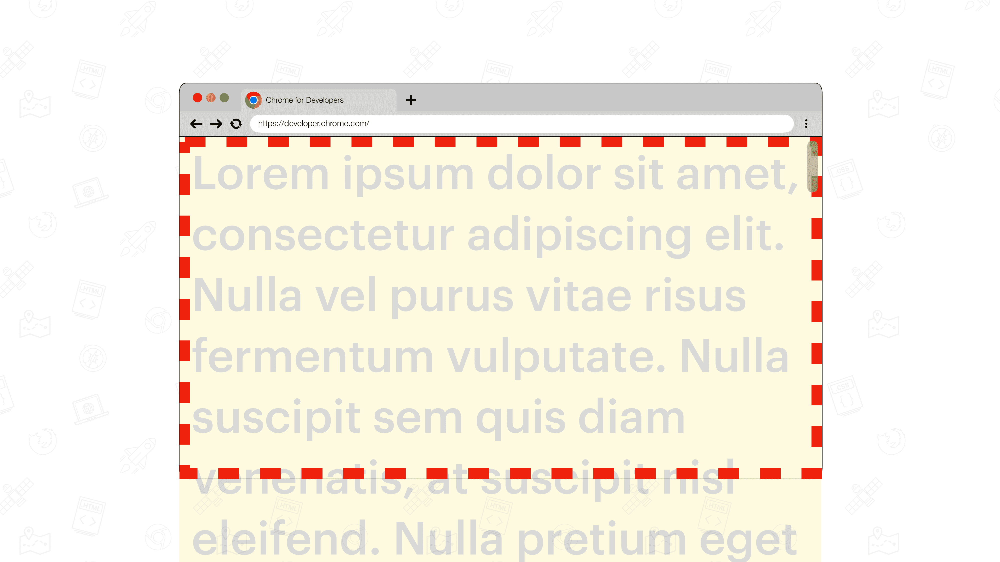
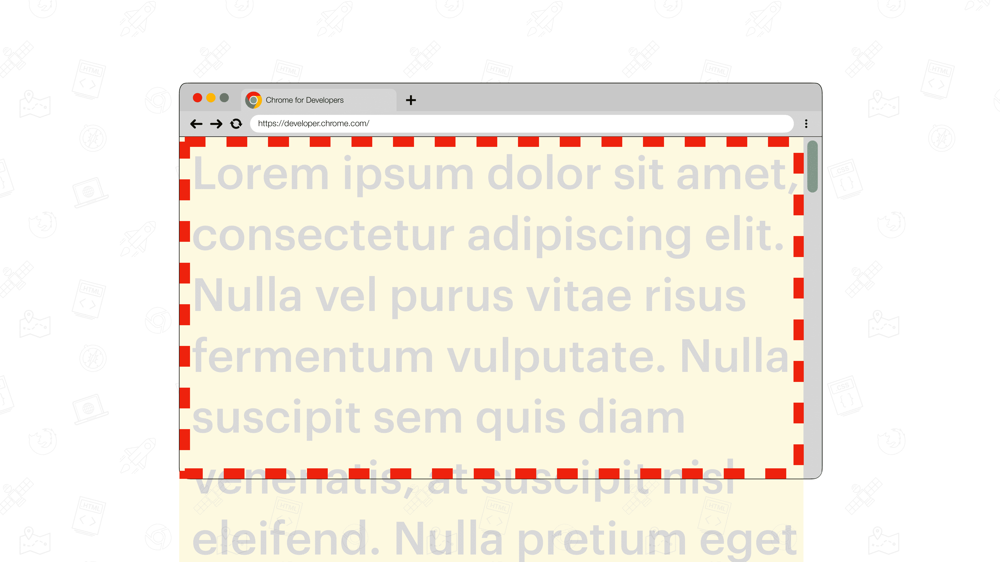

使用 `scrollbar-width` 和 `scrollbar-color` 属性设置滚动条的样式。

<!--more-->

## 简介

从 Chrome 版本 2 开始，可以使用 `::-webkit-scrollbar-*` 伪元素设置滚动条的样式。此方法在 Chrome 和 Safari 中都很有效，但 CSS 工作组从未标准化。

> MDN - ::-webkit-scrollbar Non-standard: This feature is non-standard and is not on a standards track. Do not use it on production sites facing the Web: it will not work for every user. There may also be large incompatibilities between implementations and the behavior may change in the future.

实现标准化的是 `scrollbar-width` 和 `scrollbar-color` 属性，它们是 [CSS Scrollbars Styling Module Level 1](https://drafts.csswg.org/css-scrollbars/#scrollbar-width) 的一部分。从 Chrome 121 开始，这些属性受支持。

## 滚动条入门指南

### 滚动条剖析

滚动条至少由一个轨迹和一个滑块组成。滑道是拇指可以移动的区域。轨迹表示整个滚动距离。滑块表示可滚动区域内的当前位置。滚动时，它会在轨道内移动。拇指通常也是可拖动的。

不过，滚动条可以有多个部分，而不仅仅是滑块和滑道。例如，滚动条可以包含一个或多个用于递增或递减滚动偏移的按钮。滚动条的组成部分由底层操作系统决定。



### 传统滚动条和重叠式滚动条

在介绍如何设置滚动条的样式之前，请务必先了解两种滚动条之间的区别。

| 操作系统 | 默认滚动条 |
| :------- | :--------- |
| Mac      | 叠加滚动条（Overlay scrollbars） |
| Windows  | 经典滚动条（Classic scrollbars） |

#### 叠加滚动条

叠加层滚动条是在下方内容之上的浮动滚动条。默认情况下，这些按钮不会显示，只有当主动滚动时才会显示。为了让内容保持可见状态，它们通常采用半透明形式，但这由操作系统来决定。在与它们互动时，它们的大小也可能有所变化。



#### 经典滚动条

传统滚动条是放置在专用_滚动条边线_中的滚动条。滚动条边线是内边框边缘与外内边距边缘之间的空间。这些滚动条通常是不透明的（不透明），并会占用相邻内容的某些空间。



## scrollbar-color 和 scrollbar-width 属性

### scrollbar-color 设置滚动条颜色

> 参考 https://developer.mozilla.org/zh-CN/docs/Web/CSS/scrollbar-color

借助 `scrollbar-color` 属性，可以更改滚动条的配色方案。该属性接受两个 `<color>` 值。

- 第一个值用于确定滑块（thumb）的颜色
- 第二个值用于确定要用于轨道（track）的颜色

如需使用操作系统提供的默认呈现方式，请使用 `auto` 作为其值。

```css
/* 关键字值 */
scrollbar-color: auto;

/* <color> 值 */
scrollbar-color: rebeccapurple green; /* 两个有效的颜色。
第一个应用于滚动条的滑块，第二个应用于轨道。 */

/* 全局值 */
scrollbar-color: inherit;
scrollbar-color: initial;
scrollbar-color: revert;
scrollbar-color: revert-layer;
scrollbar-color: unset;
```

默认情况下，使用叠加滚动条时，轨迹的颜色不起作用。不过，将鼠标悬停在滚动条上时，系统会显示航迹。

### scrollbar-width 设置滚动条粗细

> 参考 https://developer.mozilla.org/zh-CN/docs/Web/CSS/scrollbar-width

借助 `scrollbar-width` 属性，可以选择较窄的滚动条，甚至可以完全隐藏滚动条而不影响可滚动性。

接受的值包括 `auto`、`thin` 和 `none`。

- `auto`：平台提供的默认滚动条宽度。
- `thin`：平台提供的滚动条的细变体，或比默认平台滚动条更细的自定义滚动条。
- `none`：有效隐藏滚动条。不过，此元素仍然可滚动。

无法使用 `<length>`（例如 `16px`）作为 `scrollbar-width` 的值。

```css
/* 关键字值 */
scrollbar-width: auto;
scrollbar-width: thin;
scrollbar-width: none;

/* 全局值 */
scrollbar-width: inherit;
scrollbar-width: initial;
scrollbar-width: revert;
scrollbar-width: revert-layer;
scrollbar-width: unset;
```

使用叠加滚动条时，仅当你主动滚动可滚动区域时，才会显示滚动条滑块。

## 支持旧版浏览器

为了满足不支持 `scrollbar-color` 和 `scrollbar-width` 的浏览器版本，可以同时使用新的 `scrollbar-*` 和 `::-webkit-scrollbar-*` 属性。

```css
/* Modern browsers with `scrollbar-*` support (high priority) */
@supports (scrollbar-width: auto) {
  * {
    scrollbar-color: var(--scrollbar-thumb-color) var(--scrollbar-track-color);;
    scrollbar-width: var(--scrollbar-width);
  }
}

/* Legacy browsers with `::-webkit-scrollbar-*` support */
::-webkit-scrollbar {
  height: var(--scrollbar-width-legacy);
  width: var(--scrollbar-width-legacy);
  overflow: visible;
}
::-webkit-scrollbar-button {
  height: 0;
  width: 0;
}
::-webkit-scrollbar-corner {
  background-color: var(--scrollbar-track-color);
}
::-webkit-scrollbar-thumb {
  background-color: var(--scrollbar-thumb-color);
}
::-webkit-scrollbar-thumb:hover {
  background-color: var(--scrollbar-thumb-hover-color);
}
::-webkit-scrollbar-track {
  background-color: var(--scrollbar-track-color);
}
::-webkit-scrollbar-thumb,
::-webkit-scrollbar-track {
  background-clip: padding-box;
  border: 3px solid transparent;
  border-radius: 100px;
}
```

请注意，当设置 `::-webkit-scrollbar` 的 `width` 或 `height` 时，系统始终会显示叠加层滚动条，实际上会变为经典滚动条。



## 总结一下

可以看到，其实就目前 `scrollbar-width` 而言，其能力还是属于比较鸡肋的。相对正常的样式，仅仅多了一种瘦版样式选择以及提供了无滚动条模式。

当然，整个 `scrollbar-color` 和 `scrollbar-width` 相较于非标准的 `::-webkit-scrollbar` 规范已经是非常大的一步跨越。只是其功能的丰富性和全面性还需要等待。
