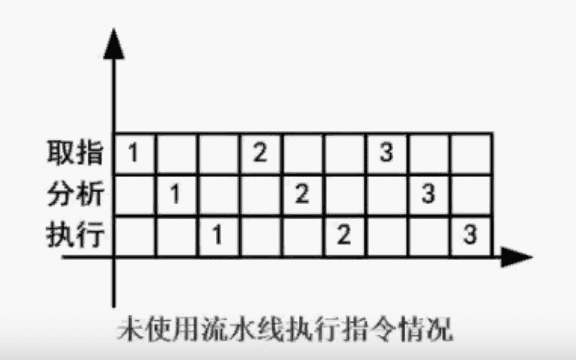
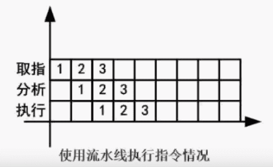
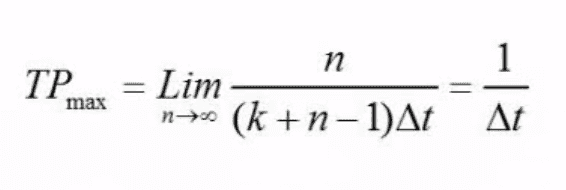
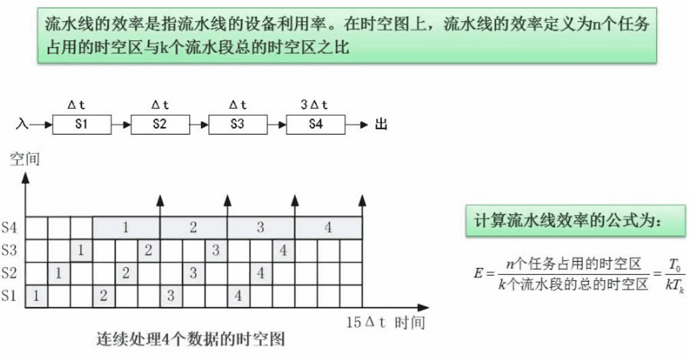
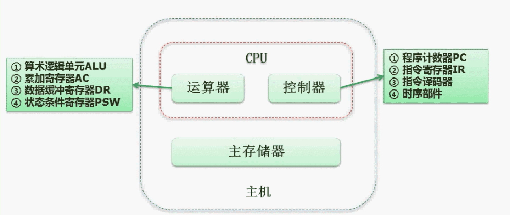

## 概念

流水线是指在程序执行时多条指令重叠进行操作的一种准并行处理实现技术。各种部件同时处理是针对不同指令而言的，它们可同时为多条指令的不同部分进行工作，以提高各部件的利用率和指令的平均执行速度。

|      未使用流水线      |      使用流水线      |
| :--------------------: | :------------------: |
|  |  |

流水线周期为执行时间最长的一段。

## 流水线计算公式

首先使用理论公式，没有答案用实践公式。

## 流水线吞吐率计算

流水线吞吐率是指单位时间内处理的任务的数量。

|     基本公式      |     最大吞吐率      |
| :---------------: | :-----------------: |
|  |  |

## 流水线加速比

完成一批任务，不使用流水线所用的时间与使用流水线所用的时间之比称为流水线的加速比。

公式：S=不使用流水线执行时间/使用流水线执行时间

流水线加速比越高越好，说明使用流水线的效果。

## 流水线的效率

## 例题

## 其他

### 主机

### CISC 和 RISC

|        类型        |                                           指令                                           | 寻址方式  |                       实现方式                       |            其他            |
| :----------------: | :--------------------------------------------------------------------------------------: | :--------: | :--------------------------------------------------: | :------------------------: |
| CISC（复杂指令集） |                            数量多，使用频率差别大，可变长格式                            | 支持多种  |                微程序控制技术（微码）                |         研制周期长         |
|                    |                                                                                          |            |                                                      |                            |
| RISC（精简指令集） | 数量少，使用频率接近，定长格式，大部分为单周期指令，操作寄存器，只有 Load/Store 操作内存 | 支持方式少 | 增加了通用寄存器；硬布线逻辑控制为主；适合采用流水线 | 优化编码，有效支持高级语言 |
